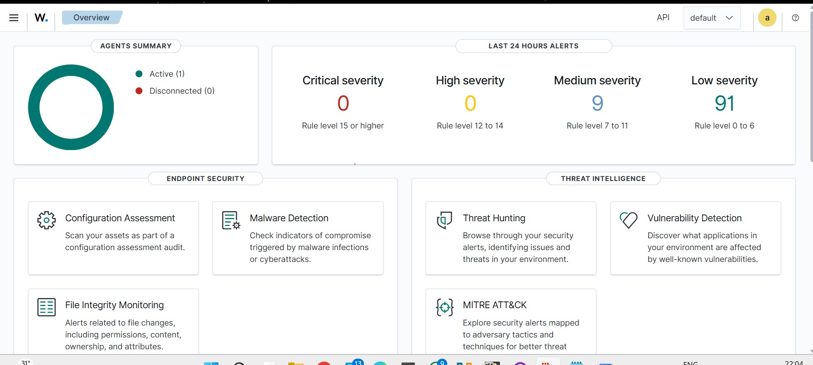
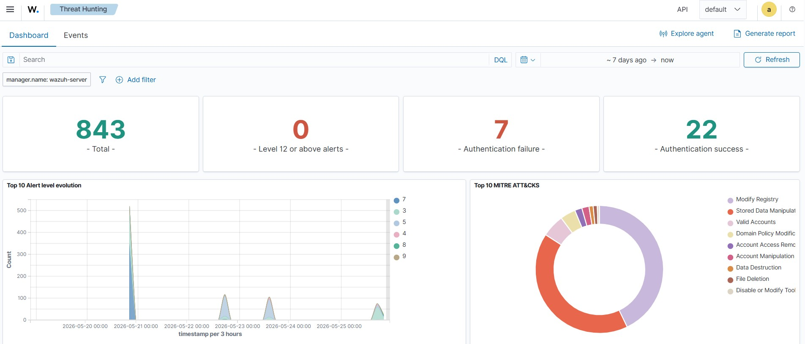
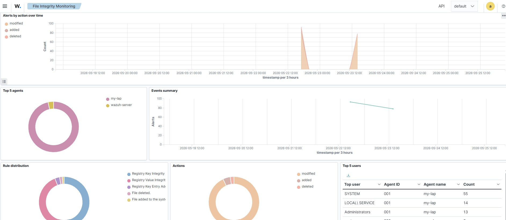
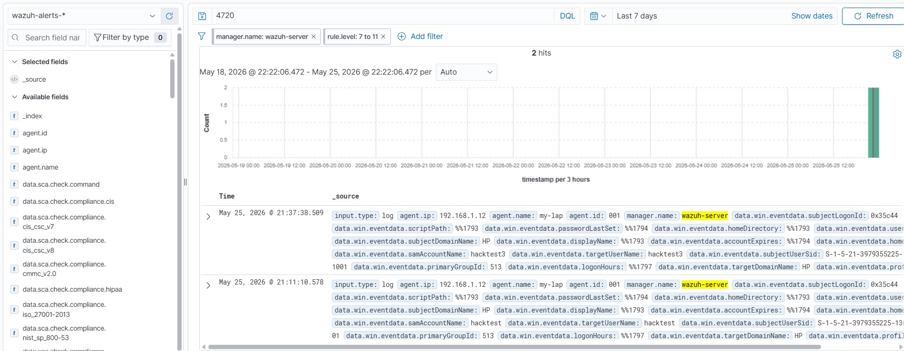
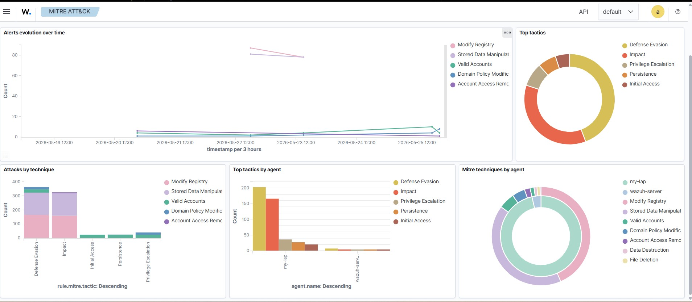

# 🛡️ SIEM Lab Project — Wazuh Home Lab

> A hands-on Security Information and Event Management (SIEM) lab built to simulate, detect, and analyze real-world cyber threats using Wazuh on a Windows environment.

---

## 📋 Table of Contents

- [Overview](#overview)
- [Lab Architecture](#lab-architecture)
- [Tools & Technologies](#tools--technologies)
- [Lab Setup](#lab-setup)
- [Attack Simulations & Detections](#attack-simulations--detections)
- [How to Reproduce This Lab](#how-to-reproduce-this-lab)
- [Key Findings](#key-findings)
- [Screenshots](#screenshots)
- [Skills Demonstrated](#skills-demonstrated)
- [References](#references)

---

## Overview

This project documents the setup and use of a home SIEM lab using **Wazuh** — an open-source security monitoring platform. The goal was to:

- Deploy a fully functional SIEM environment at zero cost
- Monitor a live Windows endpoint for security events
- Simulate real-world attacks and observe how the SIEM detects them
- Analyze alerts and map them to the **MITRE ATT&CK** framework
- Document findings in a format suitable for a SOC analyst portfolio

---

## Lab Architecture

```
┌─────────────────────────────────────────────────────┐
│                  Home Lab Environment                │
│                                                     │
│  ┌──────────────────┐      ┌─────────────────────┐  │
│  │  Windows 11 PC   │      │   Wazuh Server OVA  │  │
│  │  (Monitored      │◄────►│   (SIEM Platform)   │  │
│  │   Endpoint)      │      │   VirtualBox VM     │  │
│  │                  │      │                     │  │
│  │  Wazuh Agent     │      │  - Wazuh Manager    │  │
│  │  Installed       │      │  - Wazuh Dashboard  │  │
│  └──────────────────┘      │  - Elasticsearch    │  │
│                            │  - OpenSearch       │  │
│                            └─────────────────────┘  │
└─────────────────────────────────────────────────────┘
```

---

## Tools & Technologies

| Tool | Version | Purpose |
|---|---|---|
| **Wazuh** | 4.14.5 | SIEM Platform — log collection, analysis, alerting |
| **VirtualBox** | Latest | Virtualization — runs Wazuh server as a VM |
| **Wazuh Agent** | 4.14.5 | Installed on Windows PC to ship logs to Wazuh |
| **Windows 11** | Latest | Monitored endpoint (attack target) |
| **MITRE ATT&CK** | v14 | Threat framework for mapping detections |
| **PowerShell** | Built-in | Used to run attack simulations |

---

## Lab Setup

### Step 1 — Install VirtualBox
- Download VirtualBox from `https://www.virtualbox.org/wiki/Downloads`
- Click **Windows hosts** and run the installer
- Click through all defaults and restart your PC

### Step 2 — Download and Import Wazuh OVA
- Download the Wazuh OVA from `https://documentation.wazuh.com/current/deployment-options/virtual-machine/virtual-machine.html`
- Open VirtualBox → click **File → Import Appliance**
- Select the downloaded `.ova` file → click **Next → Import**
- Wait 5 minutes for import to complete

### Step 3 — Configure and Start the Wazuh VM
- Right-click the Wazuh VM → **Settings → System**
- Set RAM to **4096 MB** → click OK
- Click the green **Start** button
- Log into the VM console with:
  - Username: `wazuh-user`
  - Password: `wazuh`
- Run `ip a` to find the VM IP address (e.g. `192.168.x.x`)

### Step 4 — Access the Wazuh Dashboard
- Open a browser on your Windows PC
- Go to `https://192.168.x.x` (use the IP from Step 3)
- Accept the browser security warning → click **Advanced → Proceed**
- Log in with:
  - Username: `admin`
  - Password: `admin`

### Step 5 — Deploy Wazuh Agent on Windows PC
- In the Wazuh dashboard click **Agents → Deploy new agent**
- Select **Windows**
- Enter the Wazuh server IP address (from Step 3)
- Enter an agent name (e.g. `my-lap`)
- Leave group as **default**
- Copy the generated PowerShell command
- Open **PowerShell as Administrator** on your Windows PC
- Paste and run the command
- Wait 1-2 minutes — your PC will appear as **Active** in the dashboard

### Step 6 — Verify Log Ingestion
- In the Wazuh dashboard go to **Overview**
- Confirm your agent shows as **Active (1)**
- Baseline alerts from normal Windows activity will already be visible
  - 9 Medium severity alerts
  - 191 Low severity alerts


---

## Attack Simulations & Detections

---

### 🔴 Simulation 1 — Brute Force / Authentication Failure

**Objective:** Simulate a brute force login attack and verify detection by the SIEM.

**MITRE ATT&CK Mapping:**

| Tactic | Technique | ID |
|---|---|---|
| Credential Access | Brute Force | T1110 |

**Steps to Reproduce:**

1. Press **Windows + L** to lock your Windows PC
2. At the login screen, enter the **wrong password 5-6 times** deliberately
3. Log back in with the correct password
4. Go to Wazuh dashboard → **Threat Hunting**
5. In the search bar type:
   ```
   Authentication failure
   ```
6. Set time filter to **Last 1 hour** → click **Refresh**

**What to Look For in Wazuh:**
- Filter tags: `authentication_failed`, `windows`, `windows_security`
- Rule Description: `Windows Logon Failure`
- Windows Event ID: `4625`

**Result Observed:**
- Wazuh detected **6 Authentication Failure** events ✅
- Alerts correctly tagged with `authentication_failed`, `windows`, `windows_security`
- Events logged with accurate timestamps
- Alert chart showed spike at exact time of simulation

**Alert Severity:** Medium (Rule Level 5-8)

---

### 🟡 Simulation 2 — Suspicious File Creation (Malware Simulation)

**Objective:** Simulate malware dropping a suspicious executable file and detect it via Wazuh File Integrity Monitoring (FIM).

**MITRE ATT&CK Mapping:**

| Tactic | Technique | ID |
|---|---|---|
| Defense Evasion | Masquerading | T1036 |
| Execution | User Execution | T1204 |

**Steps to Reproduce:**

1. Open **PowerShell as Administrator** (right-click → Run as Administrator)
2. Run this command to create a suspicious `.exe` file:
   ```powershell
   New-Item -Path "C:\Users\Public\malware_test.exe" -ItemType File
   ```
3. Wait **2 minutes** for Wazuh FIM to detect the change
4. Go to Wazuh dashboard → **Endpoint Security → Integrity Monitoring**
5. Click on your agent name
6. Look for alerts tagged with `syscheck_entry_added`

**Alternative Search in Threat Hunting:**
- Go to **Threat Hunting**
- Click **Add filter** → set:
  - Field: `rule.groups`
  - Operator: `is`
  - Value: `syscheck_entry_added`
- Click **Refresh**

**What to Look For in Wazuh:**

| Field | Value |
|---|---|
| Rule Description | File added to the system |
| Location | C:\Users\Public\malware_test.exe |
| Rule Level | 7 (Medium) |
| Group | syscheck, file_creation |

**Cleanup After Testing:**
```powershell
Remove-Item -Path "C:\Users\Public\malware_test.exe"
```

**Result Observed:**
- Wazuh FIM detected the new `.exe` file creation ✅
- Alert appeared under `syscheck`, `syscheck_entry_added` groups
- File path, timestamp, and checksum all logged correctly

**Alert Severity:** Medium (Rule Level 7)


---

### 🔴 Simulation 3 — Unauthorized User Account Creation

**Objective:** Simulate an insider threat or attacker creating a backdoor user account and detect it via Windows Security Event logs.

**MITRE ATT&CK Mapping:**

| Tactic | Technique | ID |
|---|---|---|
| Persistence | Create Account | T1136 |
| Privilege Escalation | Valid Accounts | T1078 |

**Steps to Reproduce:**

**Part A — Create the User:**
1. Open **PowerShell as Administrator**
2. Run this command:
   ```powershell
   net user hacktest3 Password123! /add
   ```
3. Confirm it was created:
   ```powershell
   net user hacktest3
   ```

**Part B — Escalate Privileges (Optional — triggers higher alert):**
```powershell
net localgroup administrators hacktest3 /add
```
This triggers **Windows Event ID 4732** — privilege escalation alert.

**Part C — View Alert in Wazuh:**
1. Go to Wazuh dashboard → **Threat Hunting**
2. In the search bar type:
   ```
   4720
   ```
3. Set time filter to **Last 1 hour** → click **Refresh**
4. Scroll down to the alerts table
5. Click the **▶ arrow** on any alert row to expand full details

**What to Look For in Wazuh:**

| Field | Value |
|---|---|
| Windows Event ID | 4720 |
| Rule Description | Windows User Account Created |
| MITRE Technique | Account Manipulation |
| Agent | my-lap (your Windows PC) |
| data.win.eventdata.targetUserName | hacktest3 |

**Verify in Windows Event Viewer:**
1. Press **Windows + R** → type `eventvwr.msc`
2. Go to **Windows Logs → Security**
3. Click **Filter Current Log** → type `4720` → click OK
4. Find the event showing `hacktest3` was created

**Cleanup After Testing:**
```powershell
net localgroup administrators hacktest3 /delete
net user hacktest3 /delete
```

**Result Observed:**
- Wazuh detected **2 account creation events** ✅
- MITRE ATT&CK automatically mapped to **Account Manipulation**
- Alert spike visible at exact time of user creation
- Windows PC (my-lap) correctly identified as the source

**Alert Severity:** Medium-High (Rule Level 8)

---

## How to Reproduce This Lab

Follow these steps in order to rebuild this entire lab from scratch:

| Step | Action | Time |
|---|---|---|
| 1 | Install VirtualBox | 10 mins |
| 2 | Download Wazuh OVA (4GB) | 10-20 mins |
| 3 | Import OVA into VirtualBox | 5 mins |
| 4 | Start VM and access dashboard | 5 mins |
| 5 | Deploy Wazuh agent on Windows PC | 5 mins |
| 6 | Run Simulation 1 — Brute Force | 5 mins |
| 7 | Run Simulation 2 — File Creation | 5 mins |
| 8 | Run Simulation 3 — User Creation | 5 mins |
| **Total** | **Full lab setup and testing** | **~60 mins** |

**Prerequisites:**
- Windows 10 or 11 PC
- Minimum 8GB RAM (4GB for VM + 4GB for Windows)
- Minimum 50GB free disk space
- Internet connection for downloads

---

## Key Findings

| # | Simulation | Finding | Severity | MITRE Technique | Windows Event ID | Status |
|---|---|---|---|---|---|---|
| 1 | Brute Force | 6 authentication failure events detected | Medium | T1110 — Brute Force | 4625 | ✅ Detected |
| 2 | File Creation | Suspicious .exe file creation detected by FIM | Medium | T1036 — Masquerading | — | ✅ Detected |
| 3 | User Creation | Unauthorized user account creation detected | Medium-High | T1136 — Create Account | 4720 | ✅ Detected |
| 4 | Baseline | 355 medium severity alerts from normal Windows activity | Medium | Various | Various | ✅ Monitored |
| 5 | Baseline | 162 low severity alerts from normal system operations | Low | Various | Various | ✅ Monitored |


---

## Skills Demonstrated

- ✅ **SIEM Deployment** — Deployed and configured Wazuh OVA from scratch in VirtualBox
- ✅ **Endpoint Monitoring** — Deployed and managed Wazuh agent on a live Windows endpoint
- ✅ **Threat Detection** — Identified and analyzed real security alerts across 3 attack scenarios
- ✅ **Attack Simulation** — Simulated brute force, file creation, and account creation attacks
- ✅ **MITRE ATT&CK** — Mapped all detected events to ATT&CK techniques (T1110, T1036, T1136)
- ✅ **Log Analysis** — Investigated Windows Security event logs (Event IDs 4625, 4720, 4732)
- ✅ **File Integrity Monitoring** — Used Wazuh FIM to detect unauthorized file system changes
- ✅ **Incident Investigation** — Drilled into individual alerts for timestamps, sources, and rule details
- ✅ **Documentation** — Recorded all findings in a professional SOC analyst style report

---

## References

- [Wazuh Official Documentation](https://documentation.wazuh.com)
- [Wazuh OVA Download](https://documentation.wazuh.com/current/deployment-options/virtual-machine/virtual-machine.html)
- [MITRE ATT&CK Framework](https://attack.mitre.org)
- [VirtualBox Downloads](https://www.virtualbox.org)
- [Windows Security Event IDs Reference](https://www.ultimatewindowssecurity.com/securitylog/encyclopedia/)
- [Atomic Red Team — Attack Simulation](https://github.com/redcanaryco/atomic-red-team)

---

## 👤 Author

**[Your Name]**
- 🌐 Portfolio: [your-website.com]
- 💼 LinkedIn: [linkedin.com/in/yourprofile]
- 🐙 GitHub: [github.com/venkatkannan-infra]

---

> ⚠️ *This lab is for educational purposes only. All simulations were conducted in a controlled home lab environment on personally owned devices.*
